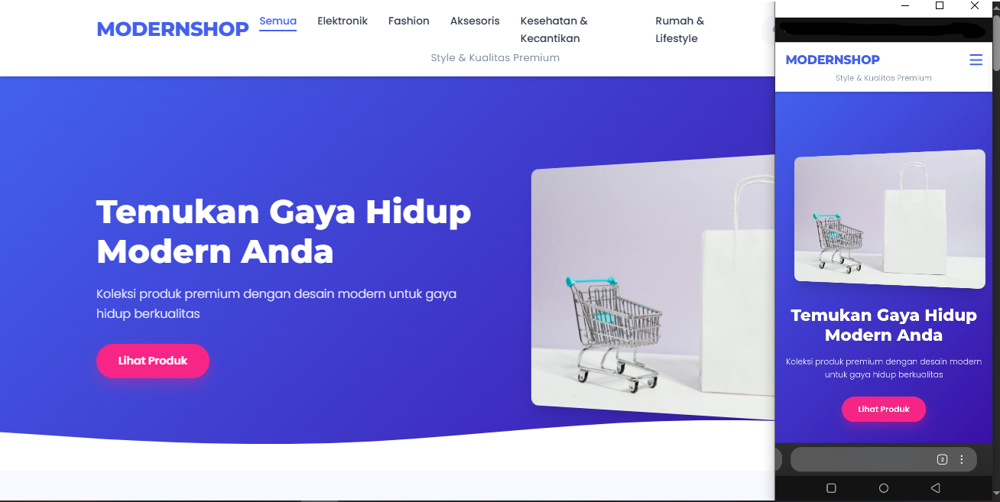

# ModernShop - Website Toko Online Modern



**ModernShop** adalah template website toko online yang modern, canggih, dan responsif. Dibuat dengan HTML, CSS, dan JavaScript murni, tanpa perlu framework tambahan. Semua pengaturan toko dan produk dikelola melalui file JSON sederhana!

## ✨ Fitur Utama

- 🎨 Desain modern, elegan dan responsif (mobile-friendly)
- 🛍️ Tambah/hapus kategori produk dengan mudah
- 📝 Kelola produk sesuai kategori
- 🔄 Atur nama produk, deskripsi, gambar, harga, link, dan badge
- 🛒 Modifikasi nama toko dan tagline
- 👨‍💼 Seting profil, deskripsi, dan kontak toko
- 🔍 Fitur pencarian produk
- 📱 Navigasi mobile-friendly
- 🌙 Modal produk untuk detail lebih lengkap
- 🎯 Auto-scrolling dan animasi halus
- 💌 Form berlangganan newsletter (dapat dikustomisasi)

## 📋 Cara Penggunaan

### Persiapan Awal

1. Download semua file dari repository ini
2. Buka file `shop-data.json` dengan editor teks (Notepad, VS Code, dll)
3. Edit file JSON sesuai kebutuhan (tutorial di bawah)
4. Buka file `index.html` dengan browser untuk melihat hasilnya

### Struktur File

```
/
├── index.html          # File HTML utama
├── styles.css          # File CSS untuk styling
├── shop-data.js        # JavaScript untuk memuat data JSON
├── main.js             # JavaScript untuk fitur interaktif
├── shop-data.json      # File JSON untuk data toko & produk
└── README.md           # Panduan penggunaan (file ini)
```

## 🛠️ Cara Mengedit Data Toko

Semua konfigurasi toko dan produk ada di file `shop-data.json`. Berikut panduan lengkap untuk mengelola toko online Anda:

### 1️⃣ Mengatur Informasi Toko

```json
"shopInfo": {
  "name": "Nama Toko Anda",
  "tagline": "Slogan toko yang menarik",
  "description": "Deskripsi lengkap tentang toko Anda",
  "image": "url-gambar-toko.jpg",
  "hero": {
    "title": "Judul Hero Section",
    "subtitle": "Subtitle untuk hero section"
  },
  "contact": {
    "phone": "08123456789",
    "email": "email@tokokamu.com",
    "address": "Alamat toko Anda",
    "whatsapp": "08123456789", 
    "instagram": "@tokokamu",
    "facebook": "namafacebook"
  }
}
```

**Tips:**
- Pastikan URL gambar benar dan bisa diakses
- Field kontak bersifat opsional, bisa dihapus jika tidak dibutuhkan
- Bagian `hero` menampilkan teks di bagian banner atas website

### 2️⃣ Menambah/Mengurangi Kategori

```json
"categories": [
  {
    "id": "elektronik",
    "name": "Elektronik"
  },
  {
    "id": "fashion",
    "name": "Fashion"
  }
]
```

**Cara menambah kategori**: Tambahkan objek baru dalam array `categories`
```json
{
  "id": "makanan",
  "name": "Makanan & Minuman"
}
```

**Penting!**
- `id` harus unik dan tanpa spasi (gunakan huruf kecil dan tanda hubung)
- `name` adalah teks yang akan ditampilkan di menu dan filter

**Cara mengubah icon dari kategori**
- buka file `main.js`
- Cari Fungsi ```getCategoryIcon```
- Lalu ubah sesuai format yang ada di https://fontawesome.com/
contoh:
```javascript
// Ubah Ikon Kategori
// Fungsi untuk mendapatkan ikon kategori berdasarkan ID
  const getCategoryIcon = (categoryId) => {
    const iconMap = {
      'elektronik': 'fa-mobile-alt',
      'fashion': 'fa-tshirt',
      'kesehatan': 'fa-heartbeat',
      'makanan': 'fa-utensils',
      'aksesoris': 'fa-gem',
      'buku': 'fa-book',
      'olahraga': 'fa-running',
      'rumah': 'fa-home'
    };
     return iconMap[categoryId] || 'fa-tag';
  };
```

### 3️⃣ Mengelola Produk

```json
"products": [
  {
    "id": "e001",
    "categoryId": "elektronik",
    "name": "Nama Produk",
    "price": "Rp 299.000",
    "description": "Deskripsi produk di sini",
    "image": "url-gambar-produk.jpg",
    "link": "https://tokopedia.com/toko/produk",
    "badge": "Terlaris"
  }
]
```

**Detail atribut produk:**
- `id`: ID unik untuk produk (bisa berupa kombinasi huruf dan angka)
- `categoryId`: Harus sesuai dengan ID kategori yang sudah dibuat
- `name`: Nama produk yang akan ditampilkan
- `price`: Harga produk (dalam format apapun)
- `description`: Deskripsi lengkap produk
- `image`: URL gambar produk
- `link`: URL untuk membeli produk (opsional)
- `badge`: Label khusus seperti "Baru", "Terlaris", dll (opsional)

## 📱 Contoh Penggunaan

### Menambah Kategori Baru

```json
"categories": [
  {
    "id": "elektronik",
    "name": "Elektronik"
  },
  {
    "id": "fashion",
    "name": "Fashion"
  },
  {
    "id": "aksesoris",
    "name": "Aksesoris"
  }
]
```

### Menambah Produk dalam Kategori

```json
"products": [
  // produk lainnya...
  {
    "id": "a001",
    "categoryId": "aksesoris",
    "name": "Gelang Etnik",
    "price": "Rp 89.000",
    "description": "Gelang etnik handmade dari pengrajin lokal",
    "image": "gelang.jpg",
    "link": "https://tokopedia.com/toko/gelang-etnik",
    "badge": "Limited"
  }
]
```

### Mengubah Informasi Toko

```json
"shopInfo": {
  "name": "Nama Toko Baru",
  "tagline": "Slogan baru yang keren",
  "description": "Deskripsi baru yang lebih menarik",
  ...
}
```

## 🔍 Pemecahan Masalah

### Website tidak menampilkan perubahan
- Pastikan file JSON sudah disimpan dengan benar
- Refresh halaman dengan Ctrl+F5 (Windows) atau Cmd+Shift+R (Mac)
- Periksa console browser (F12 > Console) untuk melihat error

### Error "Gagal memuat data toko"
- Format JSON mungkin tidak valid
- Pastikan semua tanda kurung, koma, dan kutip lengkap
- Gunakan validator JSON online seperti [JSONLint](https://jsonlint.com/)

### Gambar tidak muncul
- Pastikan URL gambar benar dan bisa diakses
- Jika menggunakan file lokal, pastikan path relatif benar

## 💡 Tips untuk Pemula

1. **Backup selalu**: Buat backup file JSON sebelum melakukan perubahan besar
2. **Copy-paste format**: Untuk menambah kategori/produk, salin format yang sudah ada dan ubah isinya
3. **Validasi JSON**: Selalu validasi JSON di [JSONLint](https://jsonlint.com/) jika mengalami error
4. **Hapus field opsional**: Jika tidak dibutuhkan, hapus field opsional seperti `badge` atau sosial media untuk menjaga file tetap rapi
5. **Eksperimen**: Jangan takut bereksperimen dengan warna dan tampilan melalui CSS

## 🎨 Kustomisasi Lebih Lanjut

Untuk pengguna yang lebih mahir, Anda bisa mengubah tampilan dan fitur website dengan mengedit file CSS dan JavaScript:

- `styles.css`: Ubah warna, font, ukuran, dan layout
- `main.js`: Modifikasi fitur interaktif dan tampilan animasi

### Mengubah Skema Warna

Untuk mengubah skema warna, buka file `styles.css` dan cari bagian `:root` di awal file:

```css
:root {
    --primary-color: #4361ee;
    --secondary-color: #3a0ca3;
    --accent-color: #f72585;
    --text-color: #2d3748;
    --text-light: #718096;
    --background-color: #f8f9ff;
    --card-color: #ffffff;
    /* ... */
}
```

Cukup ubah nilai warna sesuai keinginan dan simpan file!

---

Happy Coding! 🚀